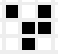
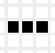
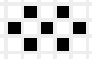

# Game of Life 

> Please refer to the UML Diagram in concert with this for greater illumination. 
(Please note that I have attempted to adhere as closely to the specifications in [The UML 2 class diagram](https://developer.ibm.com/articles/the-class-diagram/), however I have taken a liberty in the association section.)  

---

## What is it? 
In essence, the game of life is a cellular automaton that was devised by John Conway. Based on the rules below (excerpted from Wikipedia)

> 1. Any live cell with fewer than two live neighbours dies, as if by underpopulation.  
> 2. Any live cell with two or three live neighbours lives on to the next generation.  
> 3. Any live cell with more than three live neighbours dies, as if by overpopulation.  
> 4. Any dead cell with exactly three live neighbours becomes a live cell, as if by reproduction.  

the automaton's grid undergoes changes.  
Numerous patterns are possible:
1. "Gliders": this initial pattern will "glide" across the screen.  

2. "Oscillators": this initial pattern will oscillate back and forth between states.  

3. ad infinitum (nauseaum, really; this pattern though is intended to appear as the infinity symbol results in a permanent state... for infinity).  

> n.b. I restricted myself to three examples solely for brevity. I highly recommend referring to [Wikipedia's guide to Conway's 
Game of Life](https://en.wikipedia.org/wiki/Conway%27s_Game_of_Life) to explore even more interesting patterns.  

---

## How to use it? 
Upon running the application (in `./main`), you will be prompted to enter the number of columns and boxes you desire. You may choose 
to skip this process entirely and click the button for default values.  

Hereupon, you are presented with an initial grid. Populate the grid as you see fit by clicking on the boxes. If you wish to reset the board click the appropriate button. If you wish to proceed click the appropriate button.
Now you are presented with the main JFrame. The buttons ">>>" and "<<<" speed up and slow down the timer. You can toggle the timer (effectively pausing) and you can manually 
advance to the next generation as well. 

---

### Notes on my implementation.
Primary Container class is `ContainerTwoDimensionGraphic`.  
Primary Contained class is `CellTwoDimensionGraphic`.  
Graphic User Interface is `GUI`.  
For the sake of brevity, I omit regurgitation of their implementation here. 

#### \> Coordinate system
The coordinate system I use is (to my knowledge) the most prevalent system in graphics applications. The top-left corner is the origin with values 0,0. Moving right increases the x values i.e. +,0, whilst moving down increases the y value, 0,+.

#### \> Justification and solution for upholding of the ability to interact with the boxes after the initialisation of the grid 
The justification is user-interface-friendly-making is good (imagine your initial pattern leads to a pattern and you wish to know how the pattern would have reacted if some other cells were present). 

My solution is simple: instead of store the anonymous inner `MouseAdapter` class inside `CellTwoDimensionGraphic`, via a field. 
Then, just before `GUI's` method `createMainWindow()` is invoked (alongside the invocation to `dispose()`) invoke a method (that you would define), that loops through all the elements of `container` and invokes a method via them (which you will define as well) that
removes the `MouseAdapter` from the cell (via invocation of removeMouseListener(MouseListener ...); MouseAdapter implements MouseListener). Finally, you would need to define new `ContainerTwoDimensionGraphic` and `CellTwoDimensionGraphic` constructors which do not
endow the `successor's` elements with a Listener and invoke these in `ContainerTwoDimensionGraphic's` `update()` method.  
You can find vestiges of this code commented out. 

#### \> The variance in the clear methods
I formulate two measures for "clearing the board": one is inside `ContainerTwoDimensionGraphic` (`clearAll()`) which is used for the action listener for its clear button. 
The other measure can be found in the GUI class: for the clearBoard I simply define a new board (which gives each cell the default value of false and white). <br\>
Both methods accomplish the goal but `ContainerTwoDimensionGraphic's` is by far better (owing to space complexity).

#### \> Blunder Prime
Seeing the number of times I had to perform a nested iteration, I may as well have implemented the Iterator pattern. 

#### \> Improvement on Implementation
There was no need to create the class `CellTwoDimensionGraphic` at all. The reason why this class and `ContainerTwoDimensionGraphic` have 
"graphic" appended to them is because non graphic versions existed. What I should have done was keep the simple non graphic implementations 
and had a nested array of `JPanels` inside `GUI`. Updating the screen would then just have required accessing the cell states (this does introduce a layered dependency...).
(Note that this implementation still allows for colorful cells (see "Extensibility" section).

---
### Extensibility
1. The algorithm that is used by the method (in class `ContainerTwoDimensionGraphic`), `condCheckerAndUpdater` is where the criteria specified in the 
introductory section is implemented. It can be modified to construct an altered version of the GameOfLife.  

2. There are different constructors inside `CellTwoDimension` and `CellTwoDimensionGraphic`: what this means is that one may introduce the option for loading preset
patterns in the game (by invoking algorithms that set the cells appropriately). (Alternatively you could have JSON files...)

3. You can have randomised color generation for the cells by introducing new member variables which contain colours for active and deactivate, 
Since we have methods `update()` and `toggle` which can change the colours without the container classes needing to worry.

4. Seeing that I chose to make a reflexive association for class `ContainerTwoDimensionGraphic` one can modify the update method to perform 
newly introduced methods (yes new methods would be required) using `successor` such as inverting the board etc. 

5. ad insanity. 

### Decoupling
1. As should be the case in all applications that utilise graphics, I sequester the graphics and underlying data structures i.e. nigh on no computation pertaining to the algorithm for the functioning of the application 
is present inside the `GUI` class. There is a caveat here, however: `GUI` has a field, container, of type `ContainerTwoDimensionGraphic`. A JPanel, `west`, has references to a member variable of all the elements of `container`[^1].
This was so as to have the code for the presentation of the grid inside `GUI`. But this coupling is minor. Apart from this, the "cycle" of the GUI involves invocation of the `update` method of the attribute, `container` at various moments, and an 
update method (updates the display) for the `GUI` which is `west()`.

2. I feel pride over the lack of coupling between `CellTwoDimensionGraphic` and `ContainerTwoDimensionGraphic`: no direct reference to a member variable of `CellTwoDimesionGraphic` is ever exposed in this relationship and all bookkeeping is done by the cell itself (refer to the extensibility section above about adding colours to the cells).

3. `CellTwoDimension's` members `state` and `rect` are so closely coupled I contemplated creating a new class for them but circumvented this via acknowledging that I can set reminders to keep both in lockstep (this is a joke...).

[^1] : A possible solution would entail having the frame with the grid, `westForMatrix`, as a field within the `GUI` class' `container` but this solution is a prime example of the Cobra effect (out of the frying pan into the fire).

# What's next?
I wish to implement the Game of Life in a 3-Dimensional Space. I already have classes (that you won't see since they're in the private repository).
By this time, I am sussing out how exactly I should implement displaying three-dimensionality: should it be slices of 2D matrices or is it time I 
recoursed to 3D graphics packages.